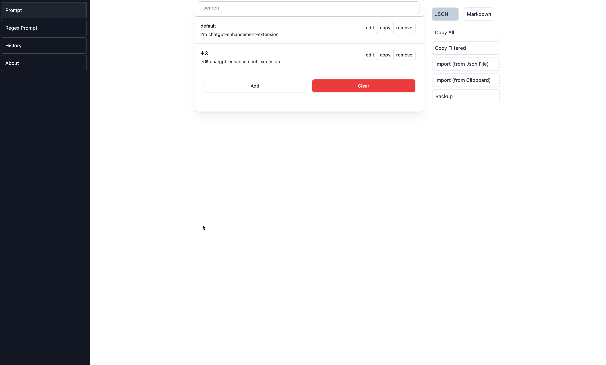
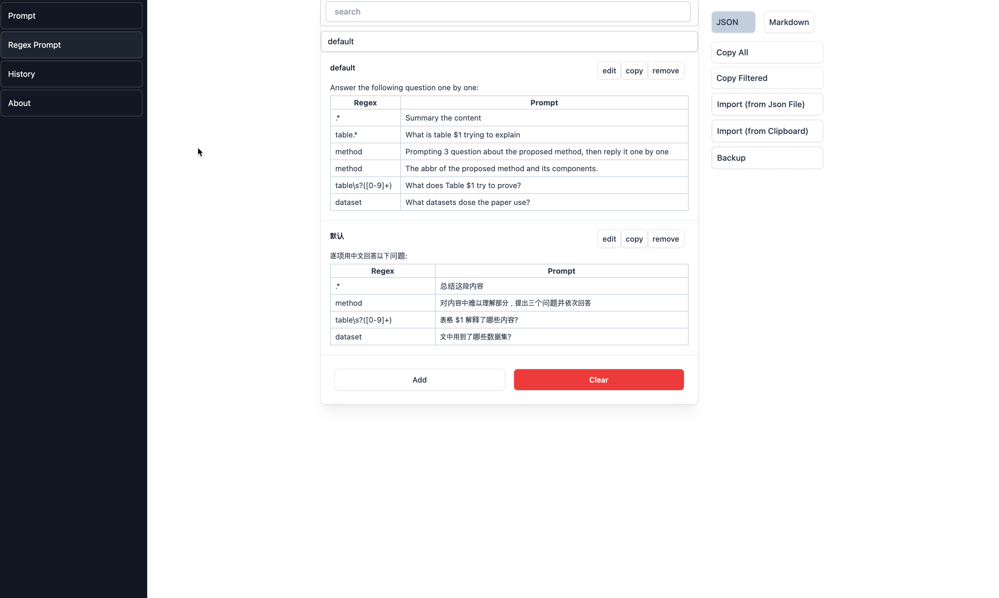
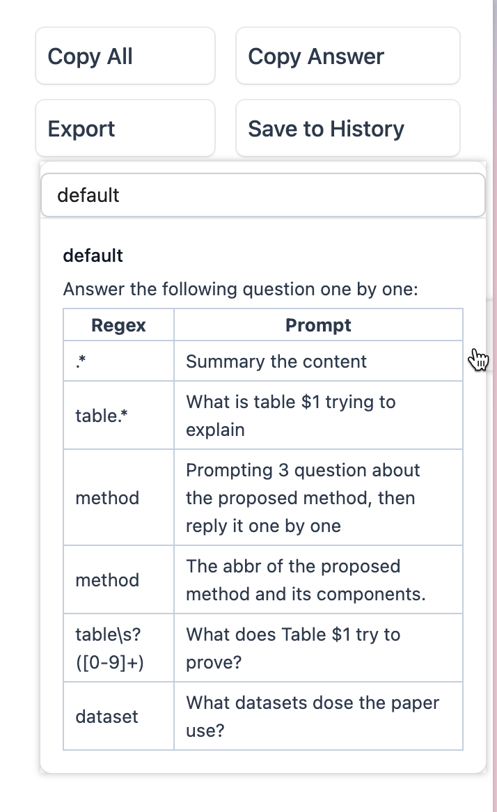

# 2023.04.16

- 版本：1.3.2
- 地址栏输入 `. ` 可以使用插件搜索，搜索文本会产生在 ChatGPT 内（但目前 Arc 浏览器不支持这种扩展）
  - 搜索文本的 Prompt 可以在 Settings 中设置
- 优化了 Settings 中的部分 UI

# 2023.04.15

- 版本：1.3.1
- 增强了和 ChatGPT 通信的稳定程度，在不存在 ChatGPT 页面的方式，会自动创建一个 ChatGPT 页面并等待
- 优化了部分 UI
- 因为 ChatGPT 官方开始逐步限制代码模拟的方式发送，优化了部分逻辑，在未来可能仍然会失效

# 2023.04.14

- 版本：1.3.0
- 新功能
  - 跨页面通信：在打开 ChatGPT 页面的情况下，在其他页面可以直接基于选择的内容进行提问（后续会支持可选的基于 api 通信的设置）
    - 在其他位置选中页面按 C 直接发送选中内容，按 X 弹出 Prompt Hint
      - 在 Settings 页面可以更改快捷键
    - Popup 按钮图标可显示当前 ChatGPT 页面打开状态，并可一键打开或切换到已激活页面
- option page
  - History 支持记录 title，并基于 title 筛选
  - 支持记录上次 option page 的 tab 位置
  - 添加了 setting page，用于之后的其他设置
- 其他
  - 优化了代码结构，删除了无用代码文件
  - 解决了一些样式问题，包括暗色模式文字显示（#3），CSS 代码污染问题
  - 更改了 Prompt-hint 弹出位置的计算方式

# 2023.04.12

- 版本号：1.2.1
- 添加了 History
- 完善了文档
- bugs
  - 屏幕大小变化时 Prompt-hint 位置不更新
- option page
  - History 页面，History 页面支持批量导出所有记录
- 其他
  - 记录每次选择的 reg-prompt group
  - 优化了 Prompt Hint 的体验：支持键盘切换和选择

# 2023.04.10

- 版本号：1.2.0
- 其他
  - 切换了[基于 vite 的脚手架](https://github.com/Jonghakseo/chrome-extension-boilerplate-react-vite)
- bug
  - 修复了多级列表转换失败的问题
- 内嵌页面
  - 新增复制和导出功能
  - 编辑框输入 `/` 弹出 Prompt 菜单
  - 在 ChatGPT 页面新增复制与导出功能
- 新增管理后台（插件按钮右键 -> 选项(Option) 进入）
  - 支持多正则匹配组，并在后台编辑功能放在后台，主页面仅保留预览和切换功能
  - 支持 Prompt 管理

