[中文](./README.zh.md)

# ChatGPT Enhancement Extension

The best ChatGPT all-in-one extension to improve your chat experience!

Features:

- [Prompt hint](#prompt-hint): type "/" in input area and see the hint.
- [PDF support](#pdf-support): Load PDF file and read page by page with [Regex Prompt Group](#regex-prompt-group).
- [Markdown convertion support](#markdown-support): Convert dialogues into markdown format.
- [Copy, Save and Export Page](#injected-button-group): Copy, Save and Export dialogues by [injected button group](#injected-button-group).
- [Admin Page](#admin-dashboard): Easy to manage all in option page.
- [All in one](#all-in-one): Open one gpt page, then you can select and prompt anywhere without API.

## Prompt hint

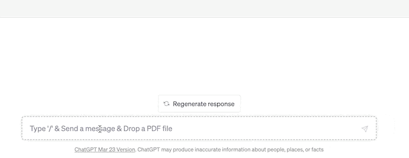

Type `Enter` to send prompt directly or `Tab` to edit it.

## PDF Support

Drag the PDF file into the textarea, then every page will generate a prompt automatically.


Additional prompts will be added to the end of each page string based on the [Regex Prompt Group](#regex-prompt-group).

### Regex Prompt Group

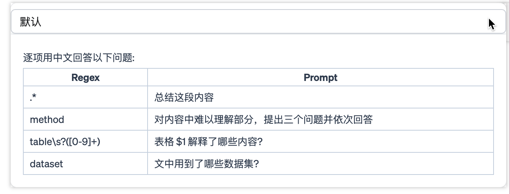
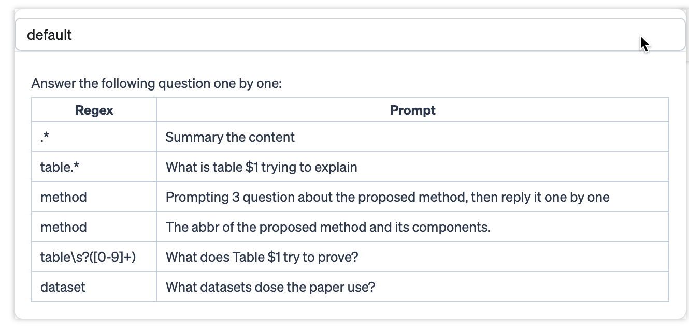

## Markdown Support

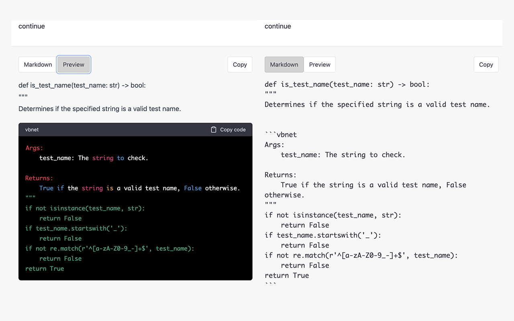

### Injected Button Group

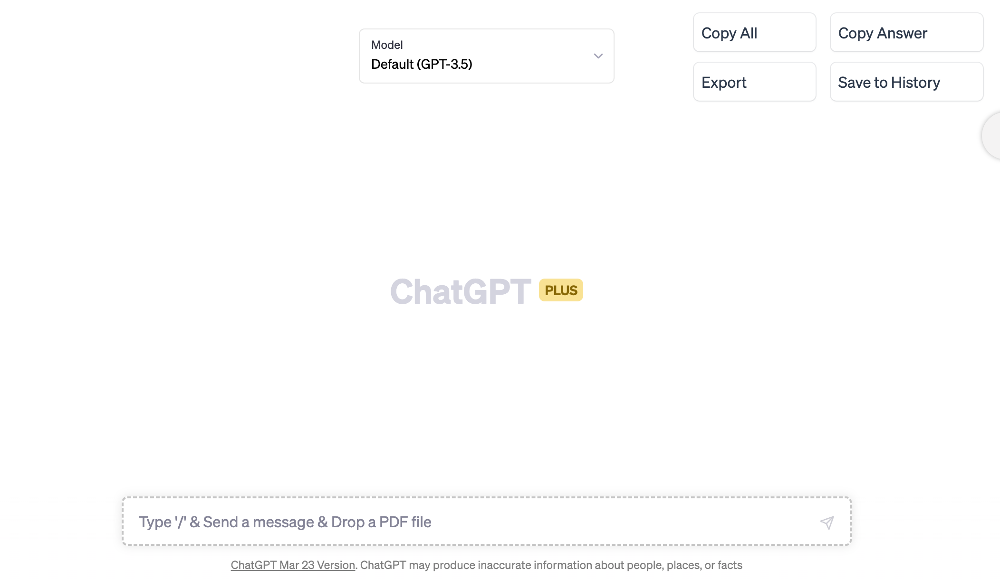

## Admin Dashboard

Prompt hints:

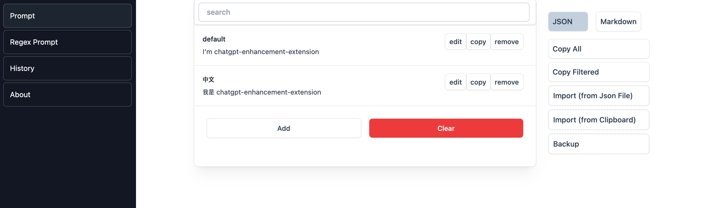

Regex prompt groups:

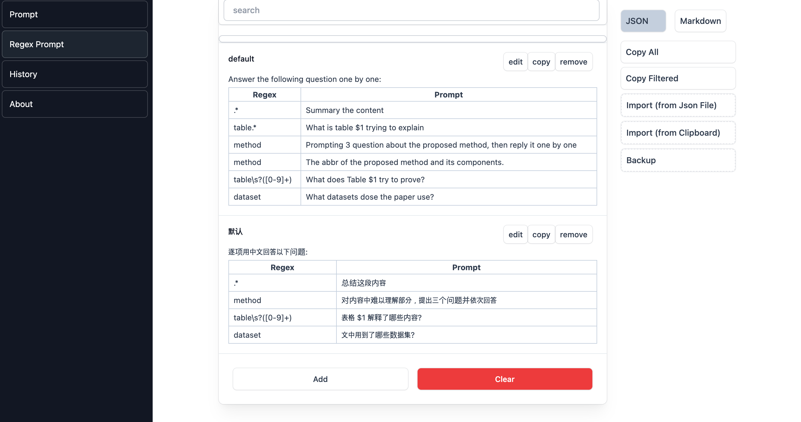

Saved dialogue history:

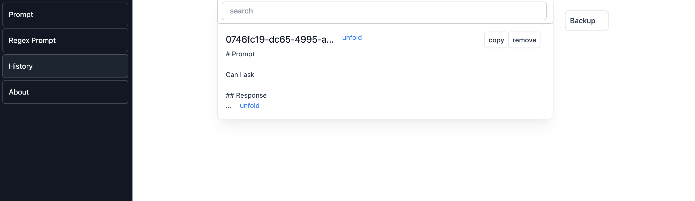

## All-In-One

Select the answer text, and then re-prompt it:

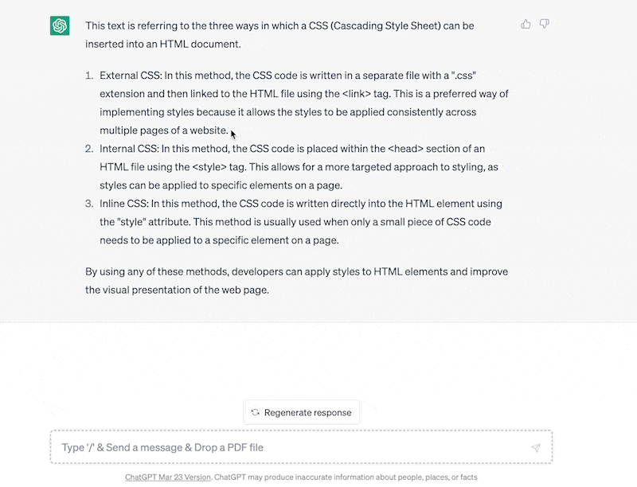

Select in any page, and prompt them:

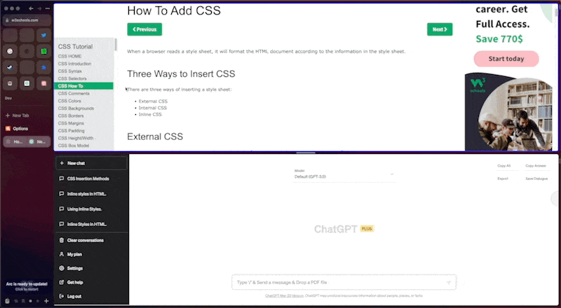

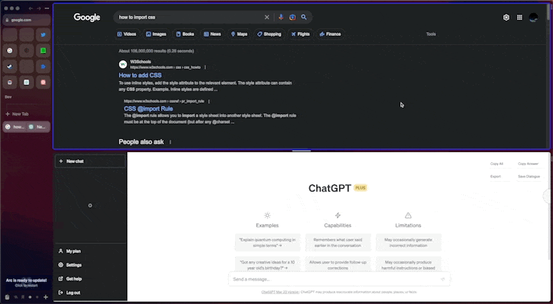

> Type `c` to send text directly, type `x` to open the prompt-hint menu. These shortcut can be changed in the `settings` tab of option page.

# How to install

## Install from Chrome Web Store

> currently pending review

## Install from crx

In Chrome/Arc/Edge browser:

- [download dist.crx](./dist.crx)
- Go to the extensions management page
- Turn on `Developer mode`
- Click on `Load unpacked` among the buttons that appear
- Drag `./dist.crx` into the extensions management page.
- Refresh the ChatGPT page

> If you have any question about load extension, try asking ChatGPT

# Development

```bash
git clone --depth=1 https://github.com/sailist/chatgpt-enhancement-extension/
cd chatgpt-enhancement-extension
npm install
npm run dev

# load ./dist in Chrome browser
```

# Buy me a coffee

This plugin is driven by my personal interest. If you like this plugin, please consider buying me a cup of coffee. Your support will encourage me to continue my work, thanks!


# Contribution

-

# Acknowledge

Thanks for the [chrome-extension-boilerplate-react-vite](https://github.com/Jonghakseo/chrome-extension-boilerplate-react-vite) scanfold and ChatGPT ❤.
