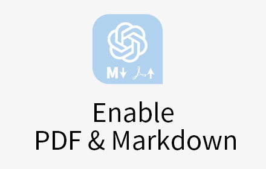
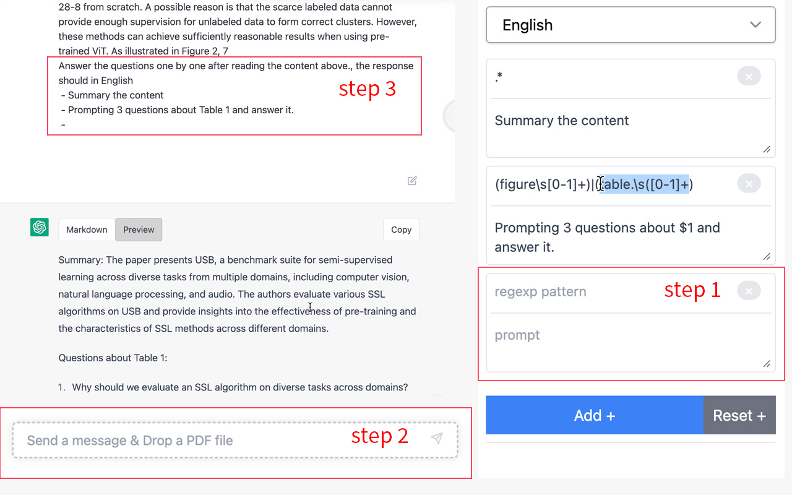

# chatgpt-markdown-and-pdf-extension



To provide additional features to enhance the ChatGPT experience, including converting replies to markdown strings, uploading files, and automatically asking questions based on regular expressions.

## Display Markdown text instead of HTML results

For better copy experimence, especially for code block, here is an example:


## Load PDF and prompting questions based on regexp

- Step 1. Write your own regexp-supported pattern and prompt
- Step 2. Drop a PDF file in the textarea
- Step 3. Wait for response



# How to install

## Install from Chrome Web Store

> currently pending review

## Install locally

```
git clone --depth=1 https://github.com/sailist/chatgpt-markdown-extension
```

In Chrome/Arc/Edge browser:

- Go to the extensions management page
- Turn on `Developer mode`
- Click on `Load unpacked` among the buttons that appear
- Load the `./dist` folder or drag `./dist.crx` into the extensions management page.
- Refresh the ChatGPT page

> If you have any question about load extension, try asking ChatGPT

# Acknowledge

Thanks for the [chrome-extension-typescript-starter](https://github.com/chibat/chrome-extension-typescript-starter) scanfold and ChatGPT ❤.
